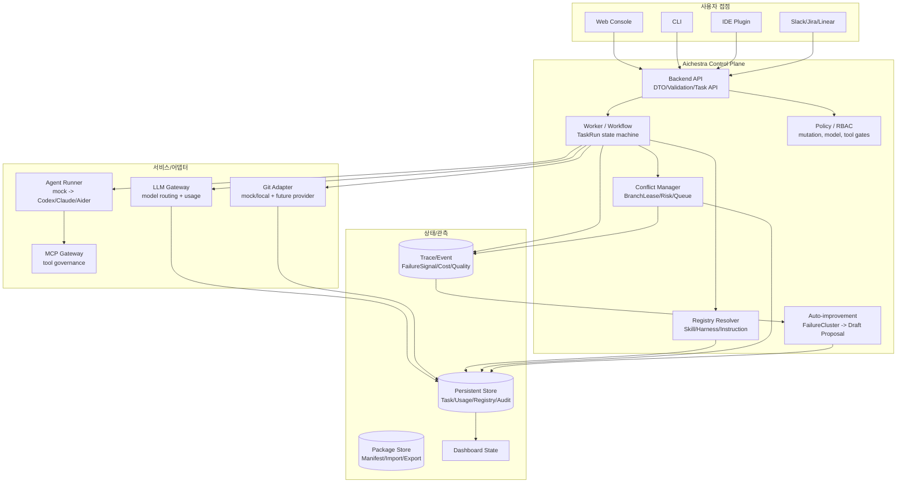
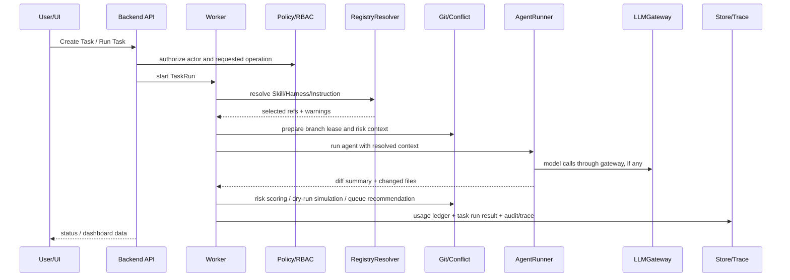
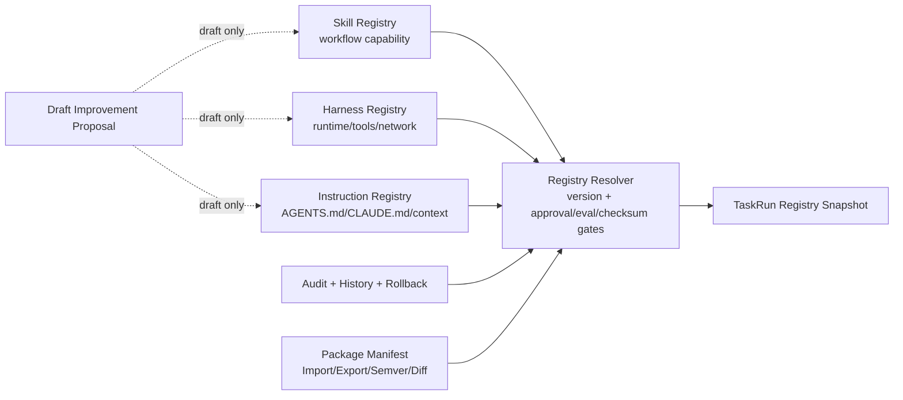
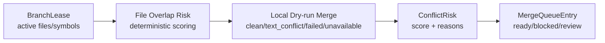
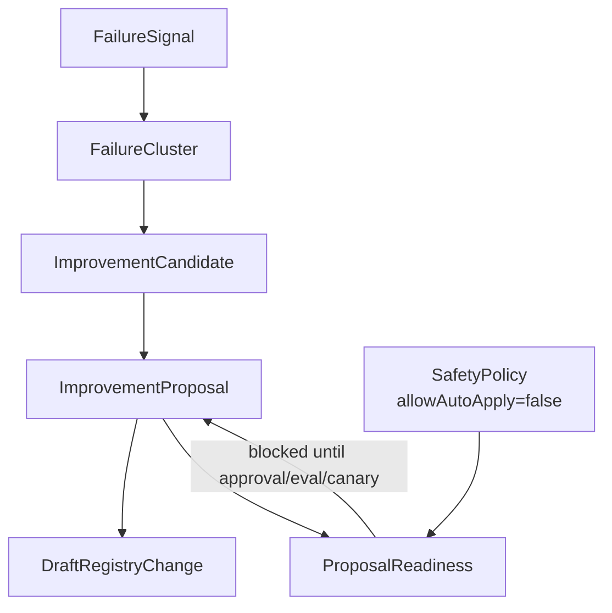

# Aichestra 기술 스택 및 동작 설계도

> 기준: mock-first AgentOps Control Plane. Phase 1~2는 current milestone 기준 완료, Phase 3는 Registry hardening/packaging 단계, Phase 4는 draft-only auto-improvement v0까지의 설계를 포함한다.

## 1. 전체 구조

## 2. TaskRun 실행 흐름

## 3. Registry 구조

## 4. Conflict Manager 구조

## 5. Auto-improvement v0 안전 루프

## 6. 핵심 원칙

- 모든 실행 결과는 `taskRunId`에 귀속한다.
- `Skill`, `Harness`, `InstructionArtifact`는 절대 하나의 타입으로 뭉치지 않는다.
- prompt instruction은 정책을 대체하지 않는다. 권한과 안전은 Policy/Runtime/Gateway에서 강제한다.
- Auto-improvement v0는 proposal과 draft change만 만들고 active registry를 자동 변경하지 않는다.
- 실제 LLM/Git/MCP/Secrets/Runtime 연동은 interface 뒤에 붙인다.
