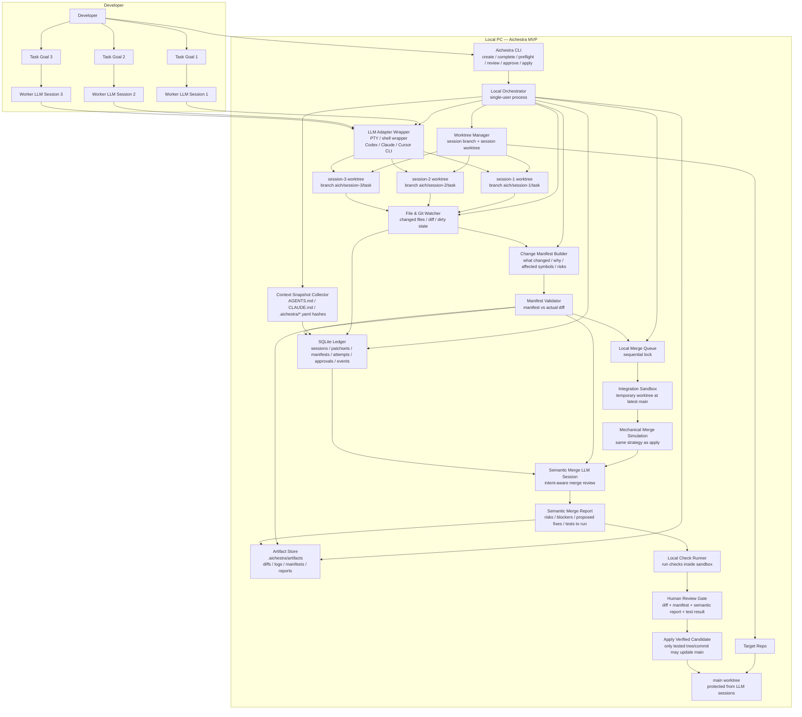

# Aichestra Local MVP Architecture

## Purpose

Aichestra Local MVP lets one developer run multiple LLM coding sessions in parallel against one repository while keeping the main branch protected by a local merge queue, integration sandbox, semantic merge review, test gate, and human approval.

The core product is not merely worktree isolation. The core product is **safe local integration of multiple LLM-produced changes**.

## MVP architecture diagram

## Runtime model

1. The developer starts one or more sessions.
2. Aichestra creates one branch and one worktree per session.
3. `aich session run <session-id>` can launch the configured provider command with the session worktree as `cwd`; the run input, stdout, stderr, and metadata are stored as artifacts.
4. Each LLM runs only in its own session worktree.
5. On completion, Aichestra records actual diffs, creates a candidate patch set, and writes a generated Change Manifest draft.
6. The generated manifest records diff-derived file evidence and remains subject to human/semantic review.
7. A candidate enters the local merge queue and appears in `aich queue` as `enqueued`.
8. Preflight acquires the local `merge-queue` lock, then creates a temporary sandbox from latest main.
9. The candidate is mechanically merged using the same strategy that will be used to apply.
10. Checks run in the sandbox and store stdout/stderr artifacts.
11. `aich review` calls the semantic review adapter, then writes a report from the manifest, related applied/queued manifests, diff evidence, mechanical merge result, configured prompt, and sandbox check results. Required checks form the gate, while optional checks remain review evidence. The default MVP adapter is local and deterministic; provider-backed LLM adapters must preserve the same advisory boundary.
12. `aich approve` records human approval for the exact verified tree/commit, including the operator identity.
13. `aich apply` acquires the same local `merge-queue` lock, then fast-forwards main to the approved verified commit only after rechecking main has not moved.
14. A candidate that should not continue can be withdrawn with `aich session abandon <session-id>`, which marks the session `abandoned` and removes it from the queue view without touching main.
15. After apply or abandon, `aich session cleanup <session-id>` or `aich session prune --applied|--inactive` can remove session worktrees, session branches, and related sandbox worktrees. No-op and failed-start sessions can also be cleaned explicitly, or pruned with `aich session prune --inactive`.

## Safety boundary

The MVP is local and non-adversarial. It does not harden the machine against malicious agents. Its primary safety mechanism is architectural separation:

- LLM session cwd is a session worktree.
- Main worktree is not handed to agents.
- Provider commands are configured under `providers.<name>.command` and receive the session task input on stdin.
- The merge queue is the only path to main.
- `preflight` and `apply` serialize queue activity through a durable SQLite `merge-queue` lock.
- `aich queue` reports candidate state from session, merge attempt, review, approval, and queue lock ledger records.
- Blocked queue entries include recovery guidance, relevant artifact paths, and the exact rerun sequence for the session candidate.
- `aich queue unlock --force` is the explicit local recovery path for stale queue locks and records `merge.queue_unlocked`.
- `aich doctor` is a read-only local health check for initialization files, ledger access, default operator identity, queue entries, stale queue lock suspicion, and interrupted apply recovery hints.
- `aich session abandon` records `session.abandoned`, refuses to run while the merge queue lock is held, and refuses sessions that are applying or already applied.
- Session cleanup is allowed for applied sessions, no-op sessions, failed-start sessions without candidate merge state, and abandoned sessions. It refuses dirty registered worktrees, records `session.cleaned`, reports cleaned sessions in status, and skips already-cleaned sessions during prune.
- Preflight and apply must use the same candidate result.
- Preflight runs configured checks inside the integration sandbox with explicit `required`, timeout, and environment settings. Required check failures or timeouts block verification; optional check failures are recorded for review without bypassing the required gate.
- Semantic review is advisory evidence. The default local adapter is deterministic, the command adapter can delegate to any provider wrapper, and the LLM adapter can run provider CLIs such as Codex with stdin/YAML report contracts. Any path can block on explicit blocker risk, but it does not approve or apply changes.
- Approval records refer to the verified candidate tree/commit, not merely the original session branch.
- Apply refuses a dirty main worktree and refuses any verified commit whose tree does not match the approved tree id.
- Apply can recover an interrupted `applying` transition only when configured main is still at `main_before` or already at the approved verified commit.

## Local auth identity

The MVP uses local operator identity, not a remote login server. `aich init` creates a default `local-user` owner in the SQLite ledger. Additional operators can be added with the auth CLI and referenced when starting sessions.

Operator identity exists to make local review and future approval records attributable. It does not provide an adversarial security boundary, token broker, or enterprise permission model.

## Main guarantee

Aichestra prevents structural breakage caused by parallel LLM coding workflows:

- no filesystem overwrite between sessions
- no direct main modification by LLM sessions
- no concurrent main updates from multiple candidates
- no stale-base candidate application without latest-main validation
- no untested candidate tree applied to main
- no unreviewed semantic risk report applied silently

It does not guarantee business correctness when tests and review are insufficient.
