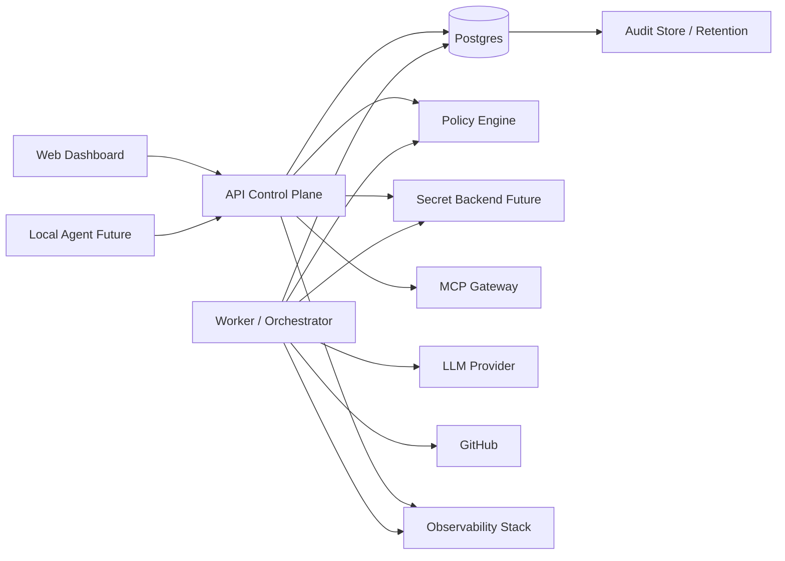

# Deployment Topology v0

This document defines production deployment topology options for planning only. It does not create deployable infrastructure, Kubernetes manifests, Helm charts, Terraform, Pulumi, or cloud resources.

## Recommended Topology

Production should split Aichestra into independently deployable units:

- Web Dashboard: static/server-rendered dashboard frontend.
- API Control Plane: authenticated REST API and read-model composition.
- Worker / Orchestrator: asynchronous task execution and provider-boundary calls.
- Migration Job: one-shot migration runner with backup gate.
- Postgres: durable application state and audit store.
- Secret Backend Future: Vault or cloud secret manager behind `SecretManager`.
- Policy Engine: current in-process policy boundary, future signed bundle/runtime.
- Observability Stack: logs, metrics, traces, dashboards, alerts, audit export.
- Local Agent: future user-machine daemon, separate from Local Agent Runner.

## Topology Diagram

## Local/Dev Profile

- Storage: in-memory default.
- Providers: mock providers.
- Dashboard: demo fallback or local API-backed read models.
- External calls: disabled.
- Auth: `MockAuthProvider`.
- Secrets: metadata-only; env provider disabled unless explicitly testing.
- MCP: mock gateway only.
- Runner: mock runner; local command execution disabled.
- Production traffic: not allowed.

## Integration Profile

- Storage: Postgres optional; `AICHESTRA_TEST_DATABASE_URL` enables optional contract tests.
- GitHub: gated by `AICHESTRA_GIT_PROVIDER=github`, remote flags, SecretRef/legacy credential path, repo allowlist, branch prefix, and integration test env.
- LLM: gated OpenAI-compatible path only.
- Webhook: optional test receiver with HMAC/mock verification.
- Auth: mock auth only.
- Secrets: SecretRef with explicit env provider; real backend not implemented.
- MCP: mock-only; no real transport.
- Production traffic: not allowed.

## Staging Profile

Required before staging can be treated as meaningful:

- Postgres required.
- Migration runner required.
- Real secret backend planned and configured.
- Real auth planned and configured.
- Provider integrations gated and allowlisted.
- Audit retention configured.
- Dashboard API-backed mode with demo fallback disabled.
- No auto-merge, force-push, branch deletion, real MCP write/deploy tools, or vendor CLI credential cache reads.

Current repository status: staging is blocked until these controls are implemented.

## Production Profile

Production requires:

- Postgres required with pooling, migration controls, backups, restore tests, retention, and index review.
- Real Auth/RBAC required; mock actor and header actor override rejected.
- Real secret backend required; no legacy env credential fallback.
- Policy bundle management required.
- Observability required.
- Audit retention/export required.
- Backup/restore required.
- Rate limit/quota required for API, Git, LLM, MCP, and Local Agent paths.
- Tenant/team/repo isolation required.
- Local Agent rollout and revocation policy required.
- No unsafe default providers.
- No production deployment until all critical blockers are closed.

## Profile Promotion Rule

Do not promote settings by copying local/integration env directly into staging or production. Promotion should move through profile-specific validation:

1. Validate required env names exist without printing values.
2. Reject unsafe defaults.
3. Verify migrations and backups.
4. Verify auth and tenant scope.
5. Verify secret backend and redaction.
6. Verify policy bundle version.
7. Verify observability and audit retention.
